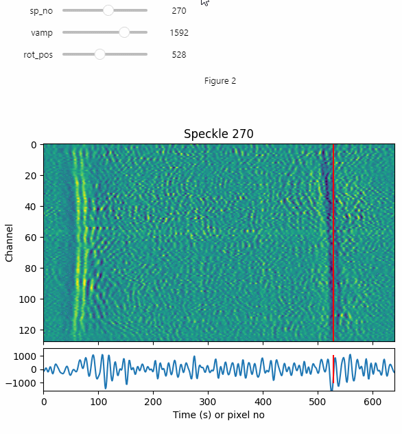
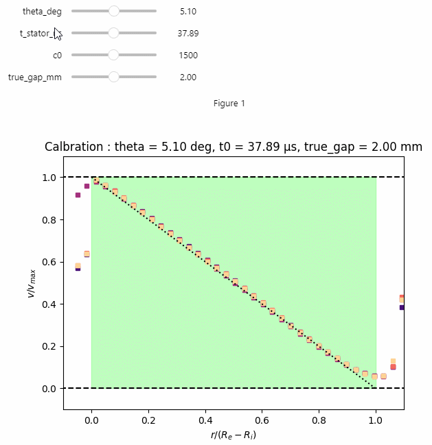
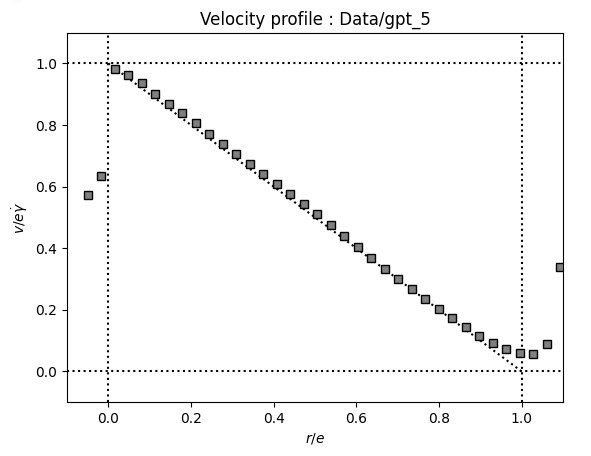
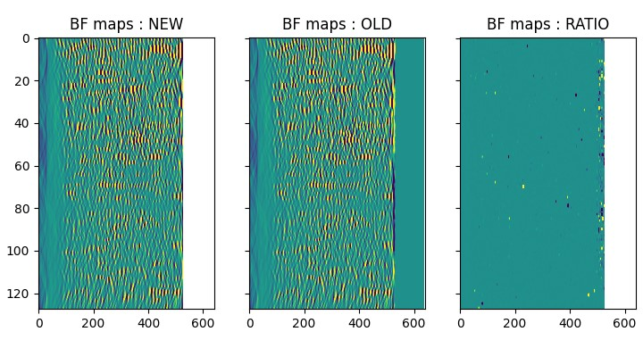
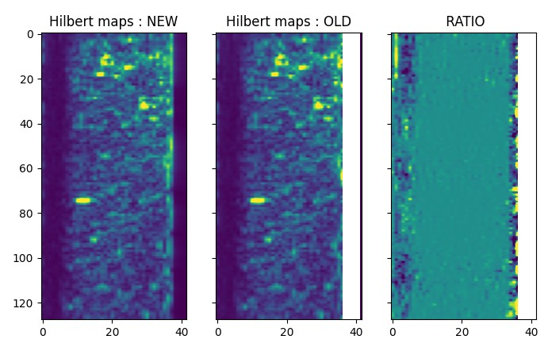
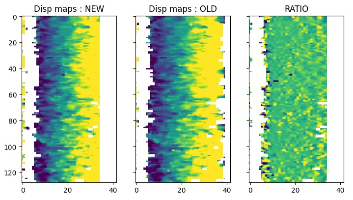

# USV processing 

## Contents

This programme processes ultrasound speckles (`Speckle_XXX.dat`) and config files (`config.mat`) based on Thomas Gallot's / Vincent Grenard's / Sébastien Manneville's scripts. 

There are four main programmes here : 

* `Process.ipynb` processes the data, including :
  * Making a Reference (using Numpy)
  * Beamforming (using Pytorch)
  * Computing the Hilbert transform to get the signal intensity (using Pytorch)
  * Computing the Displacements using cross-correlations (using Torchaudio)
  * Computes the velocity (using Numpy) if a calibration is provided

* `Benchmark.ipynb` provides side-by side comparisons between old and new data processing
* `Plot.ipynb` plots the data
* `Calib.ipynb` creates a calibration file that will be used to compute the velocity

The code will benefit from CUDA capabilities (x5 to x10 in terms of processing speed)

## Installing and running the package

First, you need to [install Python](https://www.python.org/downloads/). I don't like Conda bloatware so much, so I go directly from the Python website. Then, you can install [VSCode](https://code.visualstudio.com/download), or, if you don't like it, any editor that runs Python and Jupyter Notebooks. Jupyter Notebooks and Lab actually come with [their own editor](https://jupyterlab-exp.readthedocs.io/en/latest/getting_started/starting.html).

Then, you can either download the files of this project as a `.zip` (top right of this page, after clicking on the green `Code` button) or _clone_ the repository using `git`. If you want to do the latter, you will need to install [`git`](https://git-scm.com/install/). It will allow you to track changes in your code and clone my repository (= files) straight from Visual Studio code. You can type the command `Ctrl` + `Shift` + `P`, then, in the text box, type `Clone`, then select `Clone from GitHub` and copy-paste the address of this repository, i.e. `https://github.com/bsaintmichel/usv`. You can then select where you want to save the repository in your computer.

### A quick note on virtual environments 

Python is regularly updated, and some updates can break codes, especially if you are trying to run both recent scripts (that work with recent Python versions) and old ones (that work with Python old versions). One way to solve this issue is to have a dedicated Python installation for each project you want to run. Python uses [_virtual environments_](https://docs.python.org/3/library/venv.html). 

The syntax to create Python environments is rather simple. 

```
    python -m venv C:\path\to\new\virtual\environment   [Windows]
    python -m venv path/to/virtual/environment          [Linux / MacOS]
```

You can then access your virtual environment in the following way

```
    C:\path\to\new\virtual\environment\Scripts\activate.ps1  [Windows]
    source path/to/virtual/environment/bin/activate          [Linux/MacOS]
```

You should also find it when you try to run the Jupyter scripts of this repository (e.g. `Process.ipynb`) with VSCode when they ask you to select a Python Kernel. If you can't find it, you can always decide to `Select Another Kernel` > `Python Environments` > `Create Environment` > `Enter Interpreter Path` then look for the `python.exe` file of the virtual environment you just created (it should be in the `Scripts` subfolder). 

### Option 1 : If you want to use CUDA (= you have an NVIDIA GPU and you want to leverage it)

You need to [install CUDA](https://developer.nvidia.com/cuda/toolkit) on your machine. Install the latest version that [Pytorch supports](https://pytorch.org/get-started/locally/) and make sure that you have a version that matches what is in the file `requirements_cuda.txt` (here, I installed version 13.0 and the requirements file also points to version 13.0). 

You can then install the dependencies (using `pip`) if you _do_ have a CUDA GPU : 

```
    pip install -r requirements_cuda.txt
```

If the command `pip` does not work, you can try replacing it with `pip3` before checking for foul play.

### Option 2 : If you don't want to or can't use CUDA

Otherwise if you _don't_ have a CUDA GPU : 

```
    pip install -r requirements_cpu.txt
```

Note that Apple Metal (for M1, M2, M3, ... chips) are natively supported by Pytorch. Once again, if `pip` does not work, you can check if `pip3` does before freaking out that your Python installation is nowhere to be found.

## What the code needs to work 

- A bunch of `Speckle` files, one per each transducer (we usually have 128, but it could be any number), containing all the pulses. Our files contain a header of 120 bytes, which we skip. It is always good to know if your files also have headers and check how big they are. Otherwise, you will have to manually compare the size of the Speckle file (in bytes) with the number of pulses $\times$ the number of sample points per pulse $\times$ the number of bytes for each data point, which depends on its number format (LeCoeur Instruments uses `int16`, so two bytes per sample).

- A `config.mat` file, a legacy from Sébastien's MATLAB acquisition routines, containing acquisition parameters (number of pulses, estimated distance to region of interest, number of acquisition points for each pulse, ...). This file is converted into a `config.json` file that is more human-readable and is used later in the code, so you can in principle just provide a correct `config.json` file to process the data (and I can help you with that).

## In what order should I run things ? 

1. Process a bunch of _Calibration_ using `Processing.ipynb` where you know _a priori_ the velocity profile (we run experiments with Newtonian fluids in our Couette geometry at various, low strain rates).

2. Run the `Calib.ipynb` script with the calibration experiments to produce a calibration file (`gpt_val.json`) 

3. Process your actual experiments with `Processing.ipynb`, indicating the `gpt_val.json` calibration file to compute the calibrated velocity profiles. The programme saves the processed data as Numpy arrays in the `processed.npz` file, which then contains :

- `r_true` : basically the spatial scale in the direction of ultrasound propagation
- `hil` : the intensity of the Ultrasound signal, [actually the analytic signal corresponding to the beamformed intensity](https://en.wikipedia.org/wiki/Analytic_signal). 
- `disp` : the (uncalibrated) displacements when they are valid (i.e. the ultrasound signal intensity is high enough, and the correlation score is sufficient).
-  `ref` : the reference used in the experiment to subtract static echoes (it is usually an average of all the signals of the experiment).
- `velocity` : if applicable, the calibrated velocity.
- `score` : the correlation score for the cross-correlation used to compute the displacements.

4. Display your results using `Plot.ipynb`

## A few visualisation features

### Interactive speckle display

The programme lets you explore interactively the ultrasound speckles. This is useful to fine-tune the rotor / wall position 😉. There are also options (in the code) to show either the beamformed signal or the original signal.



### Interactive calibration

In the same fashion, the programme offers the possibility to do an "interactive" calibration to fine-tune its (many) parameters 🙂.



### Other plots 

You can, of course, check out the regular plots, e.g. the linear velocity profiles



There are also velocity maps (as shown below)


## Benchmarking new vs. old code 

### Beamforming

More details in the `Benchmark.ipynb` file. Basically, in terms of beamforming, we have the plot below. For a typical (calibration) experiment, we see that the ratio between old and new data processing is a solid blue-green color (corresponding to exactly 1) with some spots (possibly spurious raw values being removed in old code, not done currently).

The profile difference seen on the right is due to a difference in rotor position, and mostly goes away when these match.



### Hilbert intensity

Since the Beamformed signals are very similar, it is not really a surprise to see Hilbert intensity maps being similar too. Once again, some variation is observed due to a difference in the way the trimmed portions of the signal are dealt with.



### Velocity

The velocity maps benchmark shows slight differences between the old and the new data processing (the green-ish solid color on the third plot being one). This can be due to the way we rule out some of the data when the ultrasound intensity is too small : we do it with the Hilbert intensity in the new data processing, whereas it was done directly on the BF signal before. 

There are also obvious differences related to the `rotor_position` despite me using the one used in the `config_calcul.mat` file, but that can easily be fixed.



## Known bugs / quirks

* If you have multiple sequences, the program will compute the displacement (and the velocity) between all image pairs, including pairs with a last frame from sequence $n$ and the first from sequence $n+1$. You might then have to remove such values. I am keeping the code as is since achieving really low repetition rates has to be done using sequences of 1 pulses (cf. what we did with Waxy Oils).

* The code assumes the same $\Delta t$ between sequences and the same $f_{rep}$ within all sequences. I don't think we have ever done something different.
