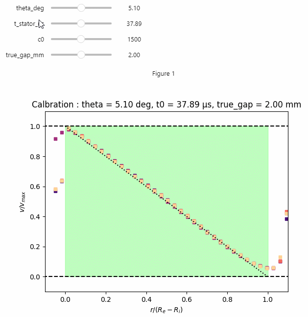

# USV processing 

## Contents

This programme processes ultrasound speckles (`Speckle_XXX.dat`) and config files (`config.mat`) based on Thomas Gallot's / Vincent Grenard's / Sébastien Manneville's scripts. 

There are four main programmes here : 

* `Process.ipynb` processes the data, including :
  * Making a Reference (using Numpy)
  * Beamforming (using Pytorch)
  * Computing the Hilbert transform to get the signal intensity (using Pytorch)
  * Computing the Displacements using cross-correlations (using Torchaudio)
  * Computes the velocity (using Numpy) if a calibration is provided

* `Benchmark.ipynb` provides side-by side comparisons between old and new data processing
* `Plot.ipynb` plots the data
* `Calib.ipynb` creates a calibration file that will be used to compute the velocity

The code will benefit from CUDA capabilities (x5 to x10 in terms of processing speed)

## Install

First, you need to [install Python](https://www.python.org/downloads/). I don't like Conda bloatware so much, so I go directly from the Python website. 

Install the dependencies (using `pip`) if you _do_ have a CUDA GPU : 

```
    pip install -r requirements_cuda.txt
```

Otherwise if you _don't_ have a CUDA GPU : 

```
    pip install -r requirements_cpu.txt
```


## A few visualisation features

### Interactive speckle display

The programme lets you explore interactively the ultrasound speckles. This is useful to fine-tune the rotor position 😉. There are also options (in the code) to show either the beamformed signal or the original signal.


### Interactive calibration

In the same fashion, the programme offers the possibility to do an "interactive" calibration to fine-tune its (many) parameters 🙂.



### Other plots 

You can, of course, check out the regular plots, e.g. the linear velocity profiles


There are also velocity maps (as shown below)


## Benchmarking new vs. old code 

### Beamforming

More details in the `Benchmark.ipynb` file. Basically, in terms of beamforming, we have the plot below. For a typical (calibration) experiment, we see that the ratio between old and new data processing is a solid blue-green color (corresponding to exactly 1) with some spots (possibly spurious raw values being removed in old code, not done currently).

The profile difference seen on the right is due to a difference in rotor position, and mostly goes away when these match.


### Hilbert intensity

Since the Beamformed signals are very similar, it is not really a surprise to see Hilbert intensity maps being similar too. Once again, some variation is observed due to a difference in the way the trimmed portions of the signal are dealt with.


### Velocity

The velocity maps benchmark shows slight differences between the old and the new data processing (the green-ish solid color on the third plot being one). This can be due to the way we rule out some of the data when the ultrasound intensity is too small : we do it with the Hilbert intensity in the new data processing, whereas it was done directly on the BF signal before. 

There are also obvious differences related to the `rotor_position` despite me using the one used in the `config_calcul.mat` file, but that can easily be fixed.


